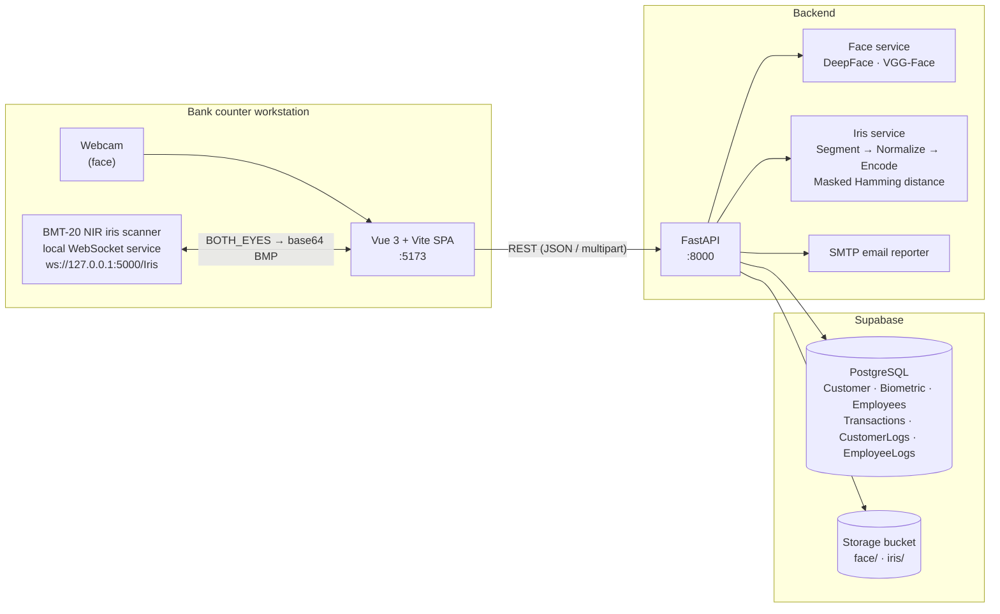

# Bio-secure

**A multimodal biometric (face + iris) identity-verification system for bank counter services.**

> Undergraduate thesis / final project — _[University name], [Faculty / Department], [Academic year]_

Bio-secure replaces (or strengthens) the traditional "show your ID card" step at a bank counter. A bank employee registers a customer once, capturing their face and both irises. When that customer later wants to deposit or withdraw money, the employee verifies them biometrically. Every attempt is logged, and the customer gets an email report of each authentication attempt.

---

## Table of Contents

- [Key Features](#key-features)
- [System Architecture](#system-architecture)
- [Tech Stack](#tech-stack)
- [Biometric Pipelines](#biometric-pipelines)
- [Verification Policy](#verification-policy)
- [Project Structure](#project-structure)
- [Database Schema (Supabase)](#database-schema-supabase)
- [API Reference](#api-reference)
- [Getting Started](#getting-started)
- [Testing](#testing)
- [Iris Model Research Notebook](#iris-model-research-notebook)
- [Limitations & Future Work](#limitations--future-work)
- [Authors](#authors)

---

## Key Features

| Area | Features |
|---|---|
| **Employee access** | Employee login with bcrypt-hashed passwords, admin / non-admin roles, route guards in the UI, every login attempt (success or failure) logged |
| **Customer onboarding** | Register customer details (National ID, name, birth date, gender, phone, email, opening balance) after a consent / agreement pop-up |
| **Biometric enrollment** | Face capture from webcam or file upload, left + right iris capture from an NIR iris scanner (BMT-20) |
| **Identity verification** | Face-only or face + dual-iris verification, with the required level chosen by the transaction amount |
| **Transactions** | Deposits and withdrawals with balance checks and per-customer transaction history |
| **Monitoring dashboard** (admin) | Registration stats (today / week / month), newest registrations, customer access events, employee login logs |
| **Account management** (admin) | Paginated CRUD for customers and employees, with password re-confirmation for sensitive actions |
| **Notifications** | HTML email to the customer after every verification attempt, success or failure (SMTP, sent as a background task) |

---

## System Architecture



---

## Tech Stack

**Frontend** — `Frontend/bio-secure-frontend`
- Vue 3 (Composition API & `<script setup>`), TypeScript, Vue Router
- Vite 6, Tailwind CSS 4, Headless UI, Heroicons
- Axios / Fetch for REST, browser `getUserMedia` for the webcam, WebSocket for the iris scanner

**Backend** — `Backend`
- Python 3.11, FastAPI, Uvicorn
- DeepFace (VGG-Face) with TensorFlow / Keras for face embeddings
- OpenCV, NumPy, SciPy, scikit-image for iris processing
- Supabase (PostgreSQL + Storage) through `supabase-py`
- Passlib + bcrypt for password hashing, `smtplib` for email
- Pytest for unit and integration tests

**DevOps**
- Docker and Docker Compose (separate containers for the backend and frontend)

---

## Biometric Pipelines

### Face recognition

1. The image is captured from the webcam or uploaded, then validated (non-empty, real image MIME type, decodable by Pillow).
2. **DeepFace `represent()`** with the **VGG-Face** model produces an embedding vector.
3. **Enrollment:** the embedding is stored as JSON in `Biometric.face_embedding`, and the image goes to Supabase Storage (`face/{national_id}_{name}.ext`).
4. **Verification:** the system computes the **cosine distance** between the live and stored embeddings.
   - Match if `distance < 0.35` (`FACE_DISTANCE_THRESHOLD` in `Backend/app/configs/settings.py`)

### Iris recognition (Daugman-style)

1. **Capture:** the NIR scanner sends left and right eye images (base64 BMP) over a local WebSocket.
2. **Preprocessing:** grayscale, histogram equalization, resize to 240×240.
3. **Segmentation:** locate the iris and pupil boundaries (`segment()` from the `iris_model/IrisRecognition` module).
4. **Normalization:** Daugman rubber-sheet model to a polar array (64 radial × 256 angular).
5. **Encoding:** binary iris code plus a noise mask (eyelids, eyelashes, reflections).
6. **Matching:** **masked Hamming distance** with circular bit-shifting (±8) to compensate for eye rotation.
7. The code and mask are stored as JSON in `Biometric.iris_left_embedding` / `iris_right_embedding`.
   - The left and right distances are averaged; match if `avg distance < 0.35`

---

## Verification Policy

How much verification is required depends on the risk of the transaction (`InfoPage.vue`):

| Transaction amount | Required verification |
|---|---|
| < 1,000,000 | **Face only** |
| ≥ 1,000,000 | **Face + left & right iris** (`full` mode) |

Overall result = `face_ok AND (iris_ok if iris images were provided)`.
- On failure, the attempt is written to `CustomerLogs` with `Result = false`.
- If the customer has an email address, an authentication report is sent in the background.

---

## Project Structure

```
Bio-secure-Web/
├── docker-compose.yml
├── Backend/
│   ├── Dockerfile
│   ├── requirements.txt
│   ├── Prove of iris model/
│   │   └── iris_recognition_pipeline.ipynb    # iris research / evaluation notebook (IITD dataset)
│   └── app/
│       ├── Main.py                     # FastAPI app, CORS, route definitions
│       ├── configs/settings.py         # env loading, Supabase client, thresholds, bcrypt context
│       ├── models/                     # Pydantic request models (customer, employee, transaction)
│       ├── services/
│       │   ├── biometric_service.py    # face & iris enrollment
│       │   ├── verification_service.py # combined face + iris verification
│       │   ├── face_service.py         # DeepFace embedding + cosine matching
│       │   ├── iris_service.py         # iris encoding + masked Hamming matching
│       │   ├── customer_service.py     # customer CRUD + transaction history
│       │   ├── employee_service.py     # employee CRUD, login, password verification
│       │   ├── transaction_service.py  # deposit / withdrawal
│       │   ├── report_service.py       # dashboard stats & logs
│       │   └── user_service.py         # customer registration
│       ├── utils/                      # email reporter, customer lookup helper
│       ├── iris_model/IrisRecognition/ # iris segmentation / normalization library (git submodule)
│       └── test/                       # pytest unit + integration tests
└── Frontend/
    └── bio-secure-frontend/
        ├── Dockerfile
        ├── BMT20-web.html              # standalone test page for the BMT-20 iris scanner
        └── src/
            ├── router/index.ts         # routes + auth/admin navigation guard
            ├── services/authService.js # reactive auth state (persisted in localStorage)
            ├── view/                   # pages (login, menu, register, identify, monitor, …)
            └── components/             # modals, nav bar, verification flow, pop-ups
```

### Frontend pages

| Route | Page | Purpose |
|---|---|---|
| `/` | `EmLogin.vue` | Employee login |
| `/main` | `MainMenu.vue` | Main menu: Register Customer, Transaction Process, View Dashboard |
| `/register` | `Register.vue` | Customer registration form + agreement |
| `/register-biometric-face/:id` | `RegisterFaceBiometric.vue` | Enroll face |
| `/register-biometric-iris/:id` | `RegisterIrisBiometric.vue` | Enroll both irises |
| `/identify` | `Identify.vue` | Customer account lookup |
| `/info/:id` | `InfoPage.vue` | Customer profile, history, deposit / withdraw with verification |
| `/monitor` | `Monitor.vue` | Monitoring dashboard (**admin only**) |
| `/monitor/account` | `AccountMag.vue` | Customer & employee management |

---

## Database Schema (Supabase)

| Table | Main columns |
|---|---|
| `Customer` | `National_ID` (PK), `Name`, `SurName`, `BirthDate`, `Gender`, `phone_no`, `Email`, `Balance`, `DOR` (date of registration) |
| `Biometric` | `National_ID` (PK/FK), `face_image_url`, `face_embedding`, `iris_left_image_url`, `iris_left_embedding`, `iris_right_image_url`, `iris_right_embedding` |
| `Employees` | `EmID` (PK), `EmName`, `EmSurName`, `EmPass` (bcrypt hash), `IsAdmin`, `FDW` (first day of work) |
| `Transactions` | `id`, `created_at`, `customer_id`, `employee_id`, `transaction_type` (`deposit` / `withdrawal`), `amount`, `note`, `balance_after` |
| `CustomerLogs` | `Customer_National_ID`, `Name`, `SurName`, `Result`, `Transaction_Timestamp` |
| `EmployeeLogs` | `Employee_ID`, `EmName`, `EmSurName`, `EmResult`, `Error`, `Log_Timestamp` |

You also need a **Storage bucket** (its name is set by `BIOMETRIC_BUCKET`) with `face/` and `iris/` folders.

---

## API Reference

Base URL: `http://localhost:8000`. Interactive docs are at **`/docs`** (Swagger UI) once the server is running.

| Method | Endpoint | Description |
|---|---|---|
| `GET` | `/` | Health check |
| **Auth / Employees** | | |
| `POST` | `/login-employee` | Log in `{ emId, password }` (every attempt is logged) |
| `POST` | `/register-employee` | Create an employee |
| `POST` | `/verify-password` | Re-confirm an employee password |
| `GET` | `/employees?page=&page_size=` | Paginated employee list |
| `PUT` / `DELETE` | `/employees/{em_id}` | Update / delete an employee |
| **Customers** | | |
| `POST` | `/register-user` | Register a customer |
| `GET` | `/customers` · `/customers-page?page=&page_size=` | List customers (all / paginated) |
| `GET` | `/customer-details/{id}` | Profile, face image and the last 15 transactions |
| `PUT` / `DELETE` | `/customers/{id}` | Update / delete a customer |
| **Biometrics** | | |
| `POST` | `/register-biometric-face` | multipart: `national_id`, `face_image` |
| `POST` | `/register-biometric-iris` | multipart: `national_id`, `left_image`, `right_image` |
| `POST` | `/verify` | multipart: `national_id` + any of `face_image`, `left_image`, `right_image` |
| **Transactions & Reports** | | |
| `POST` | `/transaction` | `{ customer_id, employee_id, transaction_type, amount, note }` |
| `GET` | `/registration-records` · `/registration-stats` | Registration list / counts |
| `GET` | `/customer-logs?show_all=&period=` | Customer access events (`period` = `today` / `week` / `month`) |
| `GET` | `/employee-logs?period=` | Employee login events |

---

## Getting Started

### Prerequisites

- Python **3.11**, Node.js **20+**
- A **Supabase** project with the tables and storage bucket listed above
- An SMTP account for email reports (optional)
- A BMT-20 NIR iris scanner with its local WebSocket service on `ws://127.0.0.1:5000/Iris` (only needed for live iris capture)

### 1. Clone the repository

```bash
git clone --recurse-submodules https://github.com/Bio-secure/Bio-secure-Web.git
cd Bio-secure-Web
```

> The iris library at `Backend/app/iris_model/IrisRecognition` is a git submodule. Make sure it is populated, because `iris_service.py` imports `iris_model.IrisRecognition.src.utils.imgutils`.

### 2. Configure environment variables

Create `Backend/.env`:

```env
SUPABASE_URL=https://<your-project>.supabase.co
SUPABASE_KEY=<service-role-or-anon-key>
BIOMETRIC_BUCKET=<storage-bucket-name>

# Email reports (optional)
EMAIL_HOST=smtp.gmail.com
EMAIL_PORT=587
EMAIL_USER=<smtp-username>
EMAIL_PASSWORD=<smtp-app-password>
SENDER_EMAIL=<from-address>
```

### 3a. Run with Docker (recommended)

```bash
docker compose up --build
```

- Frontend: http://localhost:5173
- Backend: http://localhost:8000 (Swagger UI at http://localhost:8000/docs)

### 3b. Run manually

**Backend**

```bash
cd Backend
python -m venv .venv
# Windows: .venv\Scripts\activate   |   macOS/Linux: source .venv/bin/activate
pip install -r requirements.txt
cd app
uvicorn Main:app --reload --port 8000
```

> DeepFace downloads the VGG-Face weights (~500 MB) on first use.

**Frontend**

```bash
cd Frontend/bio-secure-frontend
npm install
npm run dev
```

### 4. First login

Create the first admin employee with `POST /register-employee` (from Swagger UI at `/docs`), for example:

```json
{ "employeeId": 1001, "name": "Admin", "surname": "User", "password": "changeme", "isAdmin": true }
```

Then log in on the frontend with that Employee ID and password.

---

## Testing

The backend has **unit tests** (services, embedding comparison, iris encoding/matching, logs, transactions, auth) and **integration tests** (the `/verify` endpoint for face-only, iris-only, face + iris, invalid / corrupt / missing files, mismatches, and email triggering). Supabase and DeepFace are mocked.

```bash
cd Backend/app
pytest test/ -v
# with coverage
pytest test/ --cov=. --cov-report=term-missing
```

---

## Iris Model Research Notebook

`Backend/Prove of iris model/iris_recognition_pipeline.ipynb` documents how the iris pipeline was developed and evaluated on the **IIT Delhi (IITD) Iris Database**:

1. **Preprocessing:** Gaussian blur + histogram equalization
2. **Segmentation:** Hough Circle Transform for the pupil and iris boundaries
3. **Normalization:** Daugman rubber-sheet model (64 × 512)
4. **Feature encoding:** frequency-domain (Log-Gabor-style) binarization with an eyelid mask
5. **Matching:** masked Hamming distance
6. **Evaluation:** genuine vs. impostor score distributions, **ROC curve, AUC and Equal Error Rate (EER)**

The dataset is not included in the repository (see `.gitignore`). Download it from IIT Delhi and place it in `Backend/Prove of iris model/IITD Database/`.

---

## Limitations & Future Work

- **Iris encoding:** the production encoder uses simple threshold quantization. Replacing it with a full 1-D Log-Gabor phase encoder should improve accuracy.
- **Authentication:** the frontend keeps the session in `localStorage`, and the API has no token-based auth (JWT / Supabase Auth). Production use would need server-side session validation and role checks on every endpoint.
- **Liveness detection:** there is no anti-spoofing (presentation attack detection) for the face or iris yet.
- **Configuration:** the backend URL (`http://localhost:8000`) and scanner URL are hard-coded in the frontend and should move to `.env` (`VITE_API_URL`).
- **Templates:** biometric templates are stored as plain JSON. Template protection (encryption / cancellable biometrics) would improve privacy and PDPA compliance.
- **Thresholds** are fixed constants and could be tuned per modality from the EER analysis.

---

## Authors

| Name | Role |
|---|---|
| Philip Housden | Full-Stack Developer |
| Anuphat Manotam | Full-Stack Developer |

**Advisor:** Dr. Pikul Vejjanugraha

---

<sub>This project was developed for academic purposes as a university thesis / final-year project.</sub>
